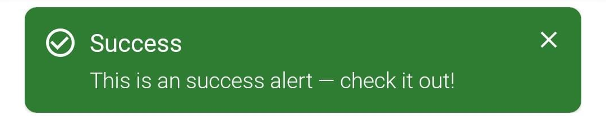

# Material Toast
Material Toast is a toast that is built based on [Alert MUI](https://mui.com/material-ui/react-alert/)

# Getting Started 
Material Toast  is distributed through Github Package. To use it, you need to do the following:

1. **Generate Personal Access Token**
   - login Github
   - go to Setting > Developer Setting > Personal Access Tokens > Generate new token
   - sure you select the following scopes: 
   - generate token
2. **Store your Github Personal Access Token details**
   - Create a `github.properties` file within the root of your library’s Android project
   - Make sure you include this file within your .gitignore as it contains sensitive credentials
   - Add properties 
      ```groovy
      ext.user=GITHUB_USERID
      ext.key=PERSONAL_ACCESS_TOKEN
      ```
      Replace GITHUB_USERID with your organisation user ID or your personal GitHub user ID. Replace **PERSONA_ACCESS_TOKEN** with the token generated in the previous step

3. **Add dependencies Material Toast** 
   - Make the following changes to your build.gradle:
      ```groovy
      apply from: rootProject.file("github.properties")
      
      android {
         ...
      
         repositories {
            maven {
                  name = "GitHubPackages"
      
                  // Replace GITHUB_USERID with your personal or organisation user ID and
                  // REPOSITORY with the name of the repository on GitHub
                  url = uri("https://maven.pkg.github.com/amary21/MaterialToast")
      
                  credentials {
                     username = ext.usr
                     password = ext.key
                  }
            }
         }
      }
      
      dependencies {
         ...
         // Your package
         implementation("com.amary.materialtoast:materialtoast:0.0.2")
      }
      ```
   - Sync your project

# How To Use
- description only
  ```kotlin
  MToast.Builder(context)
      .setType(MToastType.INFO)
      .setMessage("This is an info alert — check it out!")
      .show()
  ```
  | Toast Type         | Output                                     |
  | ------------------ | ------------------------------------------ |
  | MToastType.INFO    |        |
  | MToastType.SUCCESS |  |
  | MToastType.WARNING |  |
  | MToastType.ERROR   |      |
  
  
- title with description
  ```kotlin
  MToast.Builder(context)
      .setType(MToastType.INFO)
      .setTitle("Info")
      .setMessage("This is an info alert — check it out!")
      .show()
  ```
  
  | Toast Type         | Output                                     |
  | ------------------ | ------------------------------------------ |
  | MToastType.INFO    |        |
  | MToastType.SUCCESS |  |
  | MToastType.WARNING |  |
  | MToastType.ERROR   |      |
  
  
